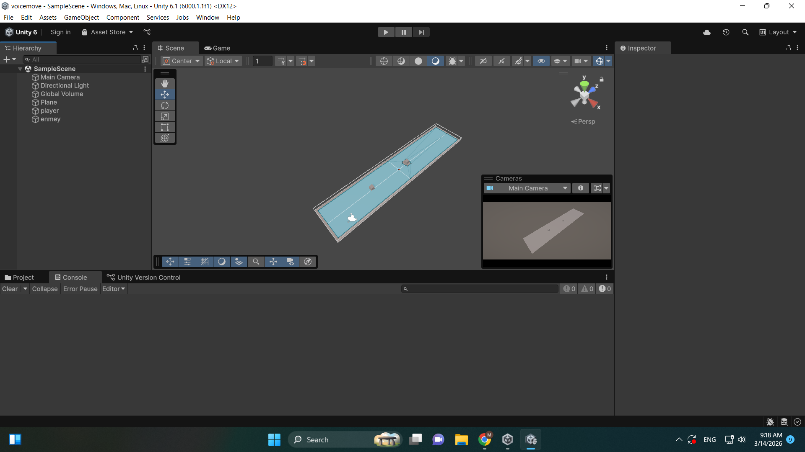
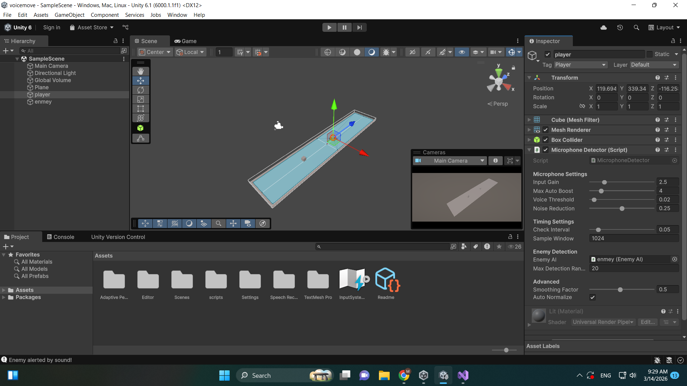
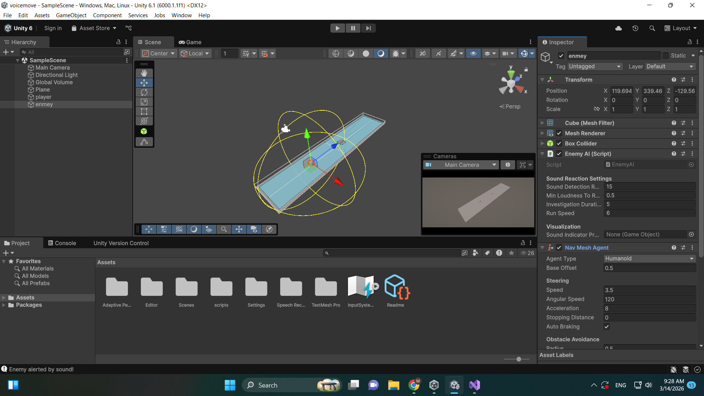
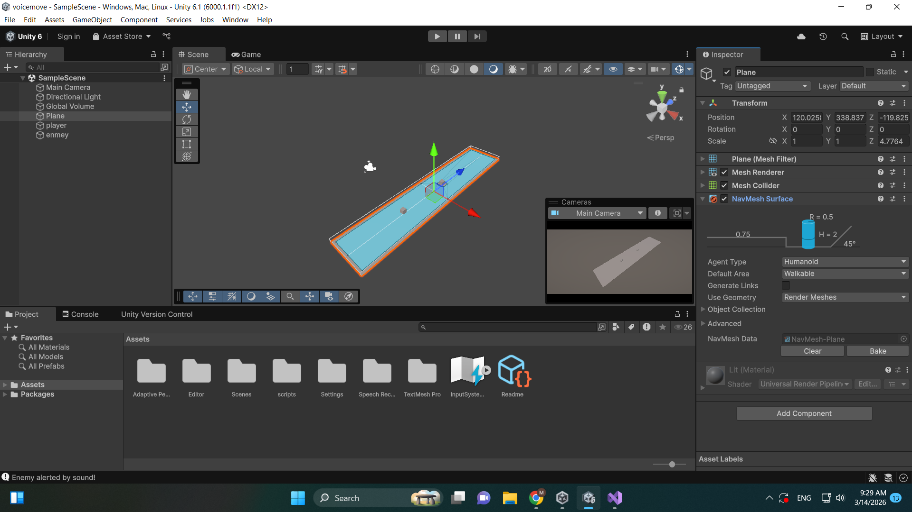

# Sound-Responsive AI System (Unity)

A robust 2D/3D interaction system where AI enemies react to real-time microphone input. This prototype demonstrates dynamic audio processing and AI state management using Unity's NavMesh system.

## Technical Highlights
- **Microphone Processing:** Real-time audio analysis with adjustable gain, auto-normalization, and noise reduction filters.
- **Signal Smoothing:** Implemented `Mathf.SmoothDamp` and linear interpolation for jitter-free detection.
- **AI Integration:** Sound intensity is mapped to a `SoundData` object, triggering the enemy's `NavMeshAgent` investigation state.
- **Debugging & Visualization:** Custom `OnDrawGizmos` and `OnGUI` implementation for real-time monitoring of microphone levels and detection ranges.

## How it works
1. The **MicrophoneDetector** captures raw data, normalizes volume peaks, and sends events to nearby **EnemyAI**.
2. The **EnemyAI** evaluates the sound intensity against its detection range before updating its destination via NavMesh.

## Technical Stack
- **Engine:** Unity 6
- **Language:** C#
- **AI:** NavMesh System

### Project Screenshots

| Description | Image |
| :--- | :--- |
| Project Hierarchy |  |
| Player Inspector |  |
| Enemy Inspector |  |
| Ground & NavMesh |  |

